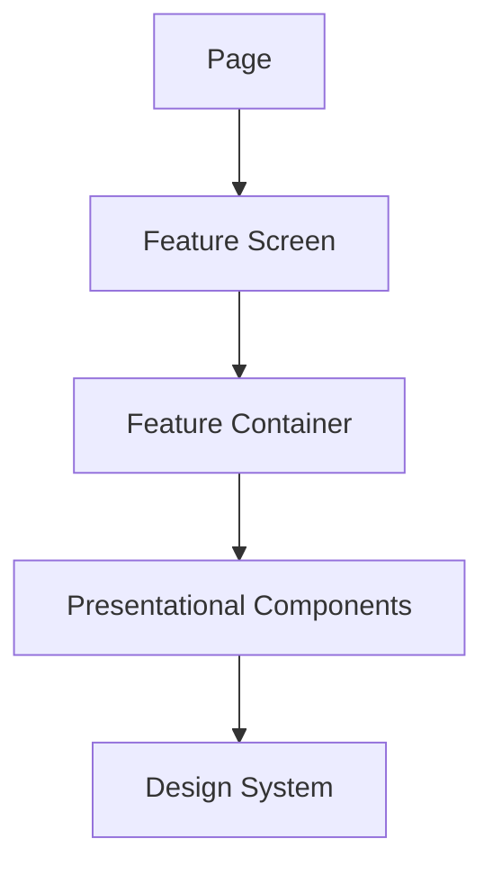

# Component Architecture

Use this reference when creating, reviewing, or refactoring components, design-system primitives, or feature boundaries.

## Boundaries

Prefer feature-oriented components with explicit responsibilities:



- Pages compose features; they do not own domain rules.
- Feature containers coordinate data and user actions.
- Presentational components render data and expose accessible interaction.
- Shared components are generic only when more than one feature needs the same contract.
- Do not extract a component only to reduce file length.
- Do not create pass-through wrappers without a clear ownership boundary.

## Component contract

Before changing a shared component, define:

```text
purpose:
rendered native element:
inputs and outputs:
owned state:
accessible name/state/focus contract:
allowed consumers:
verification:
```

Inspect the rendered element, not only the component name. A wrapper must not hide native semantics, refs, labels, disabled state, or event behavior.

## Dependency direction

Keep dependencies flowing from composition to feature behavior to reusable presentation. If a component needs domain rules, move the rule to the feature or
domain layer rather than making the shared component feature-aware.

When a shared component file changes, assign it one owner and integrate related feature changes sequentially unless the host provides isolated worktrees.
