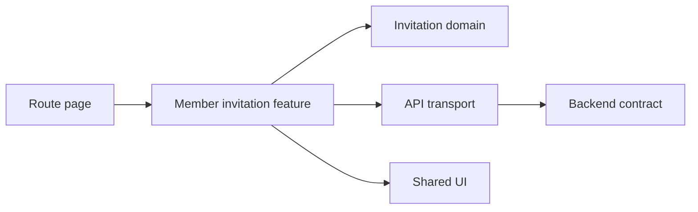

# Member invitation module boundary

<!-- Example only. Use this shape for a stable boundary shared by features or packages. Do not turn a one-off detail into architecture. -->

**Boundary:**
- `features/member-invitation` owns invitation user flows and feature state.
- `domain/invitations` owns invitation terms and invariants.
- `shared/ui` owns reusable presentation primitives only.
- `lib/api` owns transport; it does not decide invitation policy.

**Dependency direction:**

**Ownership:**
- The feature owner coordinates changes across UI, domain, and API adapters.
- The domain owner approves changes to invitation invariants.
- Shared UI changes have one owner and are integrated before dependent feature work.

**Integration rule:** Workers may implement inside this boundary. A worker must report a proposed boundary change instead of silently adding a cross-feature dependency.

**Related:**
- Feature: `docs/features/member-invitation/`
- Domain: `docs/domain/business-rules.md`
- Decision: `docs/decisions/2026-08-14-member-invitation.md`

<!-- Write the reason when the boundary is not self-evident. Update the Mermaid source whenever ownership or dependency direction changes. -->
