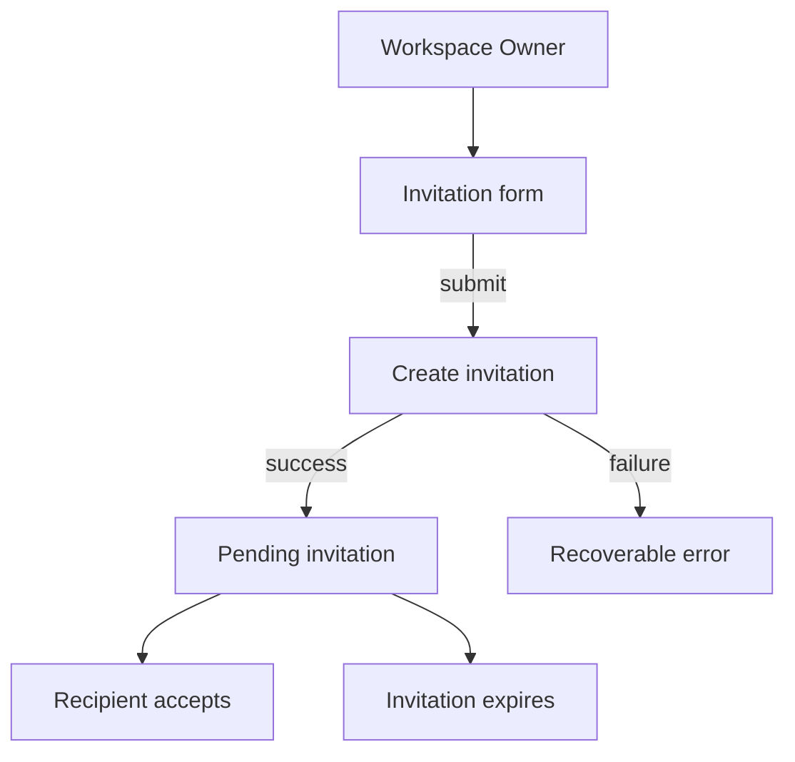
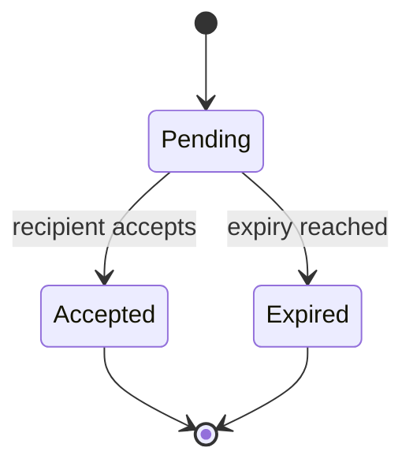

# Member invitation

<!-- Example only. Replace terms, behavior, and links with approved project knowledge. -->

**Purpose:** Allow a Workspace Owner to invite a member by email.

**Scope:**
- Create an invitation for an email address.
- Show the invitation status to the Owner.
- Allow the recipient to accept an unexpired invitation.

**Non-goals:**
- Managing Workspace roles.
- Sending reminder emails.

**User-visible behavior:**
1. An Owner submits an email address.
2. The UI shows a pending invitation after the request succeeds.
3. The recipient accepts the invitation before it expires.
4. Expired or already accepted invitations cannot be accepted again.

**Acceptance criteria:**
- Only a Workspace Owner can send an invitation.
- A pending invitation shows its current status.
- An expired invitation cannot be accepted.
- A failed request exposes a recoverable error.

**User flow:**

**State model:**

**Related:**
- Domain: `docs/domain/ubiquitous-language.md`
- Rules: `docs/domain/business-rules.md`
- Decision: `docs/decisions/2026-08-14-member-invitation.md`
- Architecture: `docs/architecture/module-boundaries.md`

<!-- Keep current behavior and acceptance criteria here. Put durable rules in the domain document, rationale in a decision record, and temporary execution details in the task packet. -->
