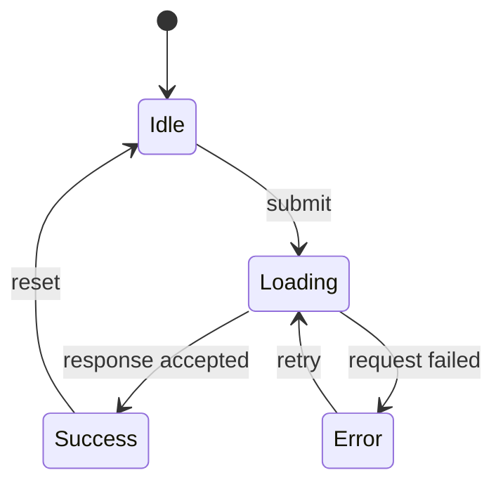

# UI State

Use this reference for loading, empty, error, disabled, pending, success, selection, focus, and other user-observable states.

## State ownership

Classify state before choosing a store:

```text
server state  query cache or data layer
URL state     router and validated URL parameters
form state    form controller or local component state
UI state      local state unless shared behavior requires otherwise
session state explicit session boundary
domain state  feature-owned domain model
```

Do not copy server data into a global store without a documented reason. Do not duplicate URL state in another store. Do not use an effect to synchronize state
that can be derived during render.

## State matrix

Every data-driven screen should model the states exposed by its contract:

```text
initial loading
refreshing
success
empty
validation error
network error
permission error
unknown failure
disabled or pending action
```

For each state, define the visible result, available actions, focus behavior, accessible announcement, and recovery path. Do not add states that the product
cannot distinguish or act on.

## State entry checklist

For every meaningful state, record:

```text
entry trigger:
data source and freshness:
visible result:
available actions:
focus and announcement:
exit or recovery path:
```

Use the same state names in feature documentation, component props, tests, and reports. If a state is only an implementation detail and has no observable
effect, keep it out of the user-facing state model.

## Transitions

Make meaningful transitions explicit. Use Mermaid when there are more than a few states or when timing and ownership could be misunderstood.



Keep business invariants in `domain.md`; this document describes how the UI represents them.

## Accessibility relation

State changes must remain understandable without color alone and must expose the correct native or ARIA state. For custom interaction, use `accessibility.md`
and verify keyboard operation, focus, names, and status announcements.
